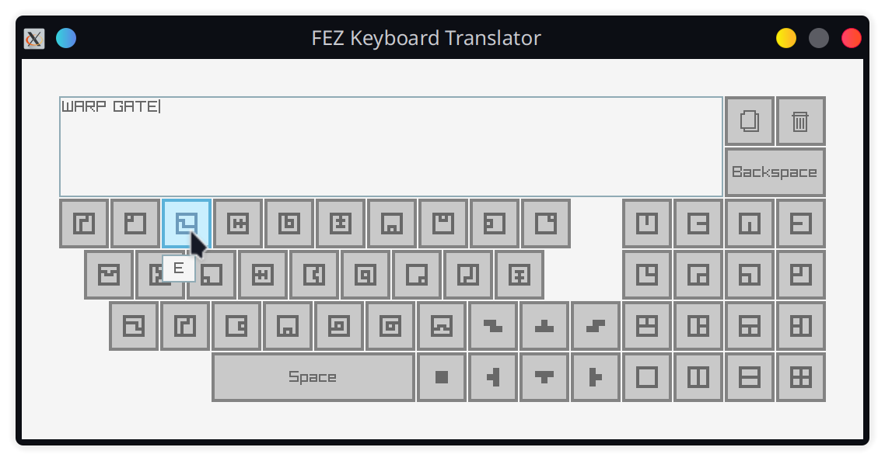

# Fez Keyboard Translator

Simple tool with virtual keyboard to translate FEZ language.



## Building

You need C++20 compiler, `cmake`, and `git`.

1. Install `raylib`'s dependencies.
2. Clone the repository with submodules.

    ```sh
    git clone {URL} --recursive
    ```

3. Configure `cmake` project inside the repo root.

    ```sh
    cmake -B build -DUSE_WAYLAND=1 -DCMAKE_BUILD_TYPE=Debug
    ```

4. Build.

    ```sh
    cmake --build build
    ```

5. Run.

    ```sh
    ./build/src/main
    ```
