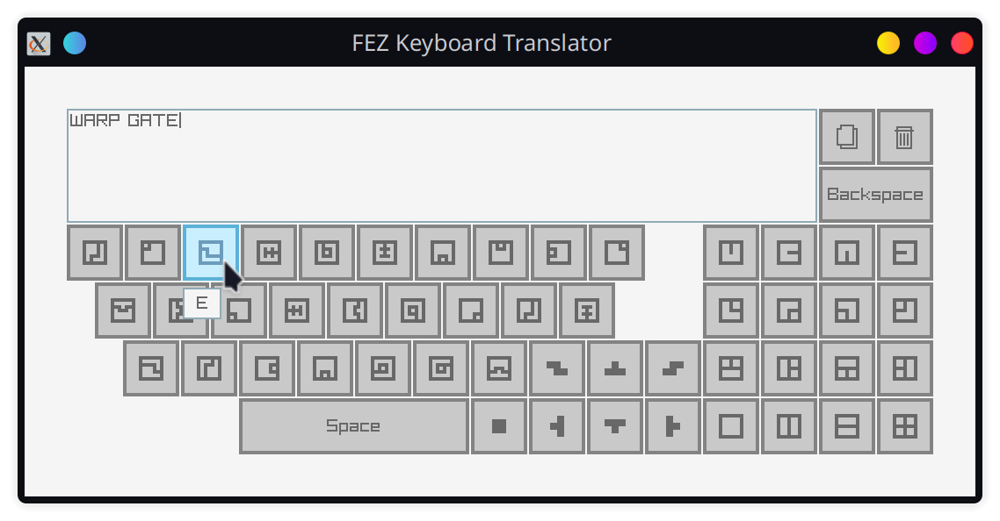

# Fez Keyboard Translator

Simple tool with virtual keyboard to translate FEZ language.



## Download

The app can be used from web browser [here](https://mrsimbax.github.io/fez-keyboard-translator/). Windows and Linux binaries can be downloaded from the [releases page](https://github.com/MrSimbax/fez-keyboard-translator/releases).

## Build

You need C++20 compiler, `cmake`, and `git`.

1. Install `raylib`'s dependencies.
2. Clone the repository with submodules.

    ```sh
    git clone {URL} --recursive
    ```

3. Configure `cmake` project inside the repo root.

    ```sh
    cmake -B build -DCMAKE_BUILD_TYPE=Debug
    ```

4. Build.

    ```sh
    cmake --build build
    ```

5. Run.

    ```sh
    ./build/src/fez-keyboard-translator
    ```
